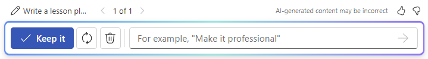
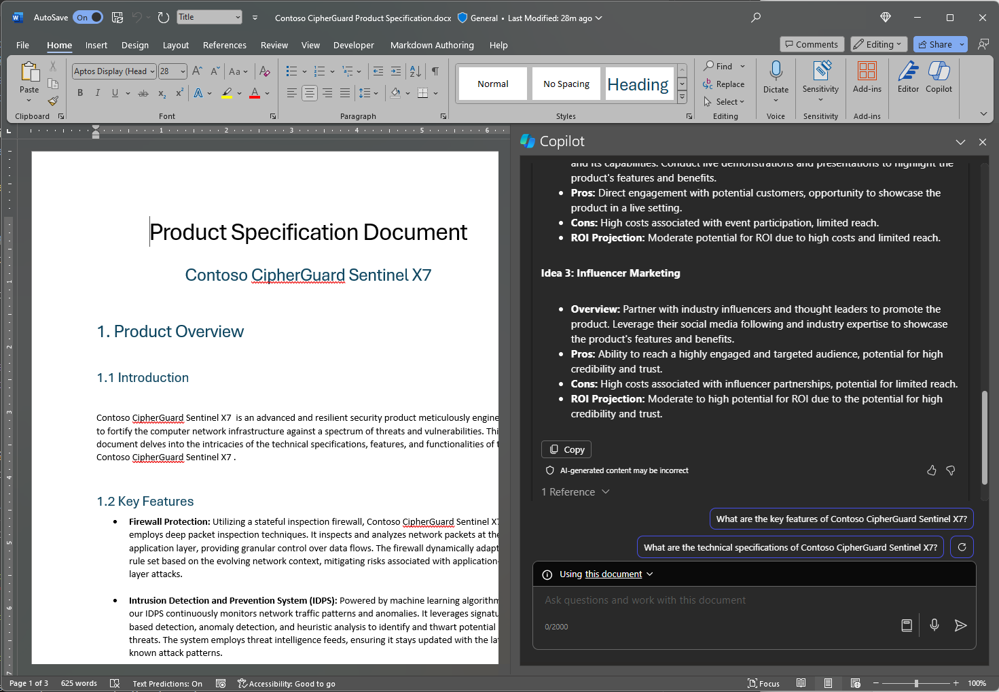

Para empezar a usar Microsoft 365 Copilot en Word, puedes abrir el panel **Copilot** seleccionando el icono Copilot en la pestaña **Inicio** de la cinta o empezar a escribir directamente en el documento.

Para empezar a redactar directamente en el cuerpo del documento:

1. Abre Microsoft Word e inicia un nuevo documento en blanco.

1. Escribe o pega el mensaje en el cuadro **Borrador con Copilot**.

1. Selecciona **Generar** y Copilot redactará contenido nuevo automáticamente.

Una vez que Copilot genere contenido, selecciona **Mantenerlo** para mantener el contenido, **Regenerar** para volver a generar una respuesta, **Descartar** para descartar el contenido o ajustar el borrador escribiendo detalles en el cuadro de redacción, como "_Hazlo más conciso_".

En el ejemplo siguiente, convertiremos un mensaje básico para Copilot en Word en un mensaje contextual bien construido que te proporcionará justo lo que necesitas, en la forma en que lo necesitas.

## Empecemos

Para empezar, descarga **_[Contoso CipherGuard Product Specification.docx](https://go.microsoft.com/fwlink/?linkid=2269123)_** y guarda el archivo en la **carpeta de OneDrive** si aún no lo has hecho.

Abre el documento en Word y luego abre el panel **Copilot** seleccionando el icono Copilot en la pestaña **Inicio** de la cinta. Escribe los mensajes siguientes y sigue las indicaciones.

> [!NOTE]
> Mensaje inicial:
>
> _Redacta una propuesta de marketing._

En este mensaje sencillo, comienza con el **objetivo** básico: _crear una nueva propuesta de marketing._ Sin embargo, no hay información sobre qué financia la propuesta o quién participa en ella.

| Elemento | Ejemplo |
| :------ | :------- |
| Mensaje básico:  Empieza con el **objetivo** | **_Redacta una propuesta de marketing._** |
| Mensaje correcto:  Agrega **contexto** | Agregar un **contexto** puede ayudar a Copilot a comprender qué tipo de documento deseas crear y para qué se usará.  "_...para el producto más reciente de Contoso: CipherGuard. Necesitamos generar tres ideas para una campaña de marketing..._" |
| Mensaje mejor:  Especifica los **Orígenes** | Agregar los **orígenes** puede ayudar a Copilot a buscar información específica.  "_...usando las especificaciones y requisitos del producto"._ |
| Mensaje recomendado:  Establece unas **expectativas** claras | Por último, agregar unas **expectativas** puede ayudar a Copilot a comprender cómo deseas que el documento se escriba y se le aplique el formato.  "_Incluye una breve introducción al producto, las ventajas y desventajas de cada idea y la proyección de ROI. Mantén el documento en dos páginas y usa un lenguaje optimista y convincente"._ |

> [!NOTE]
> **Mensaje diseñado**:
>
> _Redacta una propuesta de marketing para el producto más reciente de Contoso: CipherGuard. Necesitamos generar tres ideas para una campaña de marketing con las especificaciones y requisitos del producto. Incluye una breve introducción al producto, las ventajas y desventajas de cada idea y la proyección de ROI. Mantén el documento en dos páginas y usa un lenguaje optimista y convincente._

Revisa los resultados del mensaje y realiza un seguimiento de las preguntas o refinamientos y, después, agrégalo al final del documento en una nueva sección. **Guarda** el archivo para que lo puedas usar más adelante.

Este mensaje le da a Copilot todo lo que necesita para obtener una buena respuesta, incluido el **objetivo**, el** contexto**, el **origen** y las **expectativas**. 

### Referencia a los orígenes

Si deseas que Copilot base el nuevo documento en un archivo que ya tienes, puedes indicarle que lo haga. En el cuadro de diálogo **Borrador con Copilot**, selecciona **Hacer referencia a un archivo** para elegir **_hasta 3 archivos_** que Copilot debe examinar al crear el nuevo documento.

En el cuadro de redacción, también puedes escribir "/" y el nombre del archivo al que deseas hacer referencia, esto actualiza las opciones de archivo que se muestran en el menú para la selección.

> [!IMPORTANT]
> Debes tener permiso para acceder a los archivos a los que haces referencia, tanto si se encuentran en SharePoint como en OneDrive de tu organización y pueden ser archivos de Word o PowerPoint.

## Explorar más

¿Quieres probar? Usa el mensaje que hemos diseñado con tus propios documentos y presentaciones. Después de eso, tienes algunas sugerencias de otros mensajes que tal vez te interese probar.

- _Escribe un artículo sobre la importancia de encontrar un equilibrio entre el trabajo y la vida personal_.

- _Escribe un documento técnico sobre la administración de proyectos_.

- _Escribe una carta de oferta de empleo para un puesto de ventas en Contoso. La fecha de inicio es el 1 de agosto y el salario es de $60 000 al año más bonos_.
