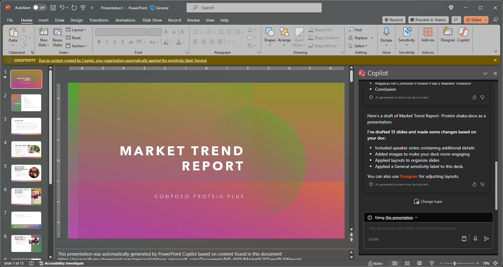

Microsoft 365 Copilot en PowerPoint es una característica con tecnología de IA que puede ayudarte a crear, diseñar y dar formato a las diapositivas.  Puedes escribir lo que piensas transmitir con tu presentación y Copilot te ayuda a hacerlo. 

Copilot puede ayudarte a desplazarte más allá de esa diapositiva inicial en blanco y conseguir que te muevas en la dirección correcta. Para empezar a usar Copilot en PowerPoint, puedes abrir el panel **Copilot** con el icono de Copilot de la pestaña **Inicio** de la cinta.

Desde el panel de Copilot, puedes empezar a crear una nueva presentación a partir de un documento de Word o sobre el tema que desees. En el ejemplo, empezamos con un mensaje básico para crear una presentación sobre un tema y agregar otros elementos para que el mensaje sea más sólido.

> [!TIP]
> Actualmente, Copilot en PowerPoint solo puede crear presentaciones a partir de documentos de Word.

## Empecemos

Si aún no lo has hecho, descarga los siguientes archivos y guarda el archivo en la **carpeta de OneDrive** para que aparezcan en la lista de MRU:

- **_[Market Trend Report- Protein shake.docx](https://go.microsoft.com/fwlink/?linkid=2268827)_**

> [!NOTE]
> Mensaje inicial:
>
> _Crea una nueva presentación de PowerPoint._

En este mensaje sencillo, empezarás con el **objetivo** básico: _crear una nueva presentación de PowerPoint._ Sin embargo, no hay información sobre el tema de la presentación o el aspecto que debe tener.

| Elemento | Ejemplo |
| :------ | :------- |
| Mensaje básico:  Empieza con el **objetivo** | **_Crea una nueva presentación de PowerPoint._** |
| Mensaje correcto:  Agrega un **contexto** | Agregar un **contexto** puede ayudar a Copilot a comprender qué tipo de documento deseas crear y para qué se usará.  "_Necesitamos presentar las características y ventajas del producto a los clientes potenciales"._ |
| Mensaje mejor:  Especifica los **orígenes** | Agregar los **orígenes** puede ayudar a Copilot a buscar información específica.  "_... usando la versión más reciente de **/Market Trend Report- Protein shake.docx**"._ |
| Mensaje recomendado:  Establece unas **expectativas** claras | Por último, agregar unas **expectativas** puede ayudar a Copilot a comprender cómo deseas que el documento se escriba y se le aplique el formato.  "_Incluye información general sobre el producto, sus características y ventajas clave, y una comparación con productos similares del mercado. Usa un lenguaje sencillo._" |

> [!NOTE]
> **Mensaje diseñado**:
>
> _Crea una presentación de PowerPoint con la versión más reciente de **/Market Trend Report- Protein shake.docx**. Necesitamos presentar las características y ventajas del producto a los clientes potenciales. Incluye información general del producto, sus características y ventajas clave, y una comparación con productos similares en el mercado. Usa un lenguaje sencillo._

Con el **objetivo**, el **contexto**, el **origen** y las **expectativas**, Copilot tiene todo lo que necesita para ofrecerte una gran respuesta.

### Referencia a los orígenes

Como en el ejemplo, si deseas que Copilot base tu nueva presentación en un archivo que ya tienes, puedes indicarle que lo haga. En la ventana del mensaje, selecciona **Crear presentación desde archivo** para elegir **_hasta 3 archivos_** que Copilot debe examinar al crear el nuevo documento.

En el cuadro de redacción, también puedes escribir "/" y el nombre del archivo al que deseas hacer referencia, esto actualizará las opciones de archivo que se muestran en el menú su selección.

> [!IMPORTANT]
> Debes tener permiso para acceder a los archivos a los que haces referencia, tanto si se encuentran en SharePoint como en OneDrive de tu organización y pueden ser archivos de Word o PowerPoint.

### Procedimientos recomendados al crear una presentación a partir de un documento de Word

Aprovecha los **estilos de Word** para ayudar a Copilot a comprender la estructura del documento. Al utilizar los **estilos** en Word para organizar el documento, Copilot comprenderá mejor la estructura del documento y cómo dividirlo en diapositivas de una presentación. Estructura el contenido en **títulos** y **encabezados** cuando corresponda y Copilot se esforzará para generar una presentación automáticamente.

### Incluir imágenes relevantes para la presentación

Al crear una presentación, Copilot intentará incorporar las imágenes en el documento de Word. Si tienes imágenes que deseas incorporar en la presentación, asegúrate de incluirlas en el documento de Word.

### Empezar con la plantilla de la organización

Si tu organización usa una plantilla estándar, comienza con este archivo antes de crear una presentación con Copilot. Al empezar con una plantilla, Copilot sabrá que desea conservar el tema y el diseño de la presentación. Copilot usará diseños existentes para crear la presentación automáticamente.

> [!IMPORTANT]
> Esta característica está disponible para los clientes con una licencia de Copilot para Microsoft 365 o Copilot Pro. Para obtener más información, consulta [Crear una presentación a partir de un archivo con Copilot](https://support.microsoft.com/office/create-a-new-presentation-3222ee03-f5a4-4d27-8642-9c387ab4854d).