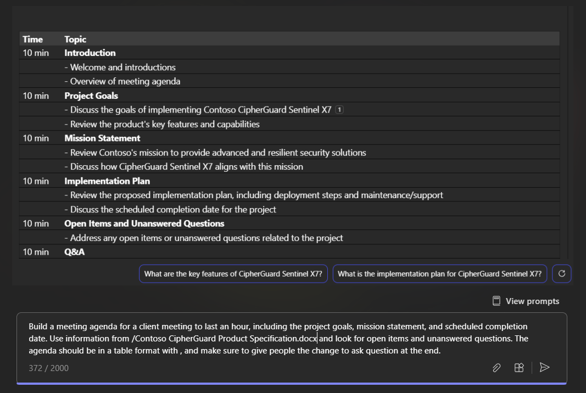

Microsoft 365 Business Chat combina la eficacia de la inteligencia artificial (IA) con tus datos y aplicaciones de trabajo para ayudarte a liberar la creatividad, desbloquear la productividad y desarrollar tus habilidades. Funciona en varias aplicaciones y contenido, lo que te proporciona la eficacia de la IA junto con los datos de trabajo seguros. Su capacidad de sintetizar información y crear cosas a partir de varios orígenes a la vez te permite abordar metas y objetivos más amplios.

Como comparación, Copilot en las diferentes aplicaciones de Microsoft 365 (como Word o PowerPoint) se orquesta específicamente para ayudarte **dentro de esa aplicación**. Por ejemplo, Copilot en Word está diseñado para ayudarte a redactar, editar y consumir contenido. En PowerPoint, está ahí para ayudarte a crear mejores presentaciones. Sin embargo con Business Chat, podemos reunirlo todo en una nueva experiencia.

Puedes acceder Business Chat de varias maneras:

- Usa Copilot en versiones móviles y de escritorio de Microsoft Teams. Consulta [Uso Microsoft 365 Business Chat en Teams](https://support.microsoft.com/topic/open-microsoft-365-chat-in-teams-c6de0a62-4f9e-479d-b5f2-af036e342181)

- Accede a Microsoft 365 Business Chat en Microsoft.com/copilot. Consulta [Uso de Microsoft 365 Business Chat en Microsoft.com/Copilot](https://support.microsoft.com/topic/use-microsoft-365-chat-at-microsoft365-com-or-in-the-microsoft-365-office-app-4a2538f9-962f-4c7c-a368-f6006bc13d6f)

## Empecemos

Con **Contoso CipherGuard Product Specification.docx** de una unidad anterior, abre Business Chat en Teams para trabajar en el siguiente mensaje.

> [!NOTE]
> Mensaje inicial:
>
> _Crea la agenda de una reunión._

En este mensaje sencillo, empezarás con el **objetivo** básico: _crear una agenda de reunión._ Sin embargo, no hay información sobre el propósito o el objetivo de la reunión.

| Elemento | Ejemplo |
| :------ | :------- |
| Mensaje básico:  Empieza con el **objetivo** | **_Crea la agenda de una reunión._** |
| Mensaje correcto:  Agrega un **contexto** | Agregar **Contexto** puede ayudar a Copilot a comprender por qué organizas la reunión y que es lo que deseas discutir.  "_...que la reunión con el cliente dure una hora e incluya los objetivos del proyecto, la declaración de objetivos y la fecha de finalización programada"._ |
| Mensaje mejor:  Especifica los **orígenes** | Agregar los **orígenes** puede ayudar a Copilot a saber dónde buscar información específica.  "_Usa la información de **/Contoso CipherGuard Product Specification.docx** y busca elementos abiertos y preguntas sin responder"._ |
| Mensaje recomendado:  Establece unas **expectativas** claras | Por último, agregar unas **expectativas** puede ayudar a Copilot a comprender cómo deseas que el documento se escriba y se le aplique el formato.  "_La agenda debe estar en formato de tabla con asignaciones de tiempo y asegúrate de dar a las personas la oportunidad de formular preguntas al final"._ |

> [!NOTE]
> **Mensaje diseñado**:
>
> _Crea una agenda de reunión para que una reunión con el cliente dure una hora e incluya los objetivos del proyecto, la declaración de objetivos y la fecha de finalización programada. Usa la información de **/Contoso CipherGuard Product Specification.docx** y busca elementos abiertos y preguntas sin responder. La agenda debe estar en formato de tabla con asignaciones de tiempo, y asegúrate de dar a las personas la oportunidad de formular preguntas al final._

Revisa la agenda y realiza cualquier ajuste o refinamiento y agrégala a la invitación a la reunión en Teams.

### Referencia a los orígenes

Como en el ejemplo, si deseas que Copilot base tu nueva presentación en un archivo, una reunión o una persona (incluso las tres cosas), puedes indicarle que lo haga. En la ventana del mensaje, basta con empezar a escribir una barra diagonal "/" y una ventana emergente te ofrecerá reuniones, archivos o personas recientes a los que hacer referencia.

> [!IMPORTANT]
> Debes tener permiso para acceder a los archivos a los que haces referencia, tanto si están ubicados en SharePoint de tu organización como en OneDrive y pueden ser archivos de Word, Excel o PowerPoint.

## Explorar más

Estas son algunas sugerencias de otros mensajes que tal vez te interese probar. Cópialos y modifícalos para ajustarlos a tus necesidades.

- ¿Qué pasó en mi última reunión?

- Ponerme al día en los chats no leídos.

- Redacta un mensaje que indica que los OKR se deben entregar la próxima semana.

- Dile a mi equipo cómo actualizamos la estrategia de producto.

- Resume los chats, los correos electrónicos y los documentos sobre el escalamiento de [un cliente] que se produjo anoche.

- ¿Cuál es el siguiente hito en [un proyecto]? ¿Hay algún riesgo? Ayúdame a pensar en una lista de algunas posibles formas de mitigación.

- Escribe un resumen de planificación con el estilo de [un archivo] que contenga la escala de tiempo de [un archivo diferente] y que incorpore la lista de proyectos en el correo electrónico de [una persona]. 
