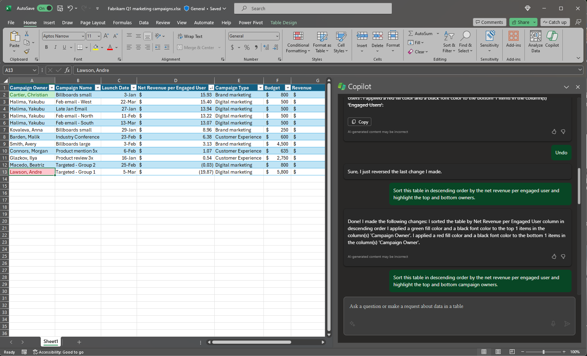

Con Microsoft 365 Copilot en Excel, es fácil resaltar, ordenar y filtrar tus tablas para destacar rápidamente las cosas importantes. Con una sola tabla en Excel, puedes tener Copilot sin esfuerzo: 

- Organiza y filtra tus datos

- Aplica el formato condicional simple.

Para empezar, da formato a los datos como una tabla y selecciona el icono de **Copilot** en la cinta de opciones. Después, indica a Copilot cómo deseas manipular la tabla para ver mejor fragmentos de tus datos. 

En el ejemplo siguiente, empezaremos con un mensaje sencillo e iremos agregando elementos a lo largo del camino. Sigue el ejemplo con tus propios datos.

## Empecemos

Para empezar, descarga **_[Fabrikam Q1 marketing campaigns.xlsx](https://go.microsoft.com/fwlink/?linkid=2269124)_** y guarda el archivo en la **carpeta de OneDrive** si aún no lo has hecho.

Abre la hoja de cálculo en Excel y, después, abre el panel **Copilot** seleccionando el icono de Copilot en la pestaña **Inicio** de la cinta. Escribe los mensajes siguientes y sigue las indicaciones.

> [!NOTE]
> Mensaje inicial:
>
> _Ordena esta tabla._

En este mensaje sencillo, empezarás con el **objetivo** básico: _ordenar y filtrar una tabla de Excel_. Sin embargo, no hay ninguna indicación de cómo deseas ordenar los datos y qué campo deseas filtrar.

| Elemento | Ejemplo |
| :------ | :------- |
| Mensaje básico:  Empieza con el **objetivo** | **_Ordena esta tabla..._** |
| Mensaje correcto:  Agrega un **contexto** | Agregar un **contexto** puede ayudar a Copilot a comprender la finalidad de las diapositivas y en qué tema debe centrarse.  "_...para buscar el comercial de mayor impacto"._ |
| Mensaje mejor:  Especifica los **orígenes** | Se supone que el **origen** de este mensaje es la tabla con la que estamos trabajando en Excel.  "_...esta tabla [Table1]..._" |
| Mensaje recomendado:  Establece unas **expectativas** claras | Por último, agregar unas **expectativas** puede ayudar a Copilot a comprender cómo deseas que la tabla se ordene, filtre y presente.  "_Add a third column that calculates the net revenue per engaged user, taking into account their budget costs. Sort this table in descending order by the net revenue per engaged user and highlight the top and bottom owners._" |

> [!NOTE]
> **Mensaje diseñado**:
>
> _Ordena esta tabla [Table1] para buscar el comercial de mayor impacto. Agrega una tercera columna que calcule los ingresos netos por usuario comprometido, teniendo en cuenta sus costes presupuestarios. Ordena esta tabla en orden descendente por los ingresos netos por usuario comprometido y resalta los mejores y peores propietarios._

Este mensaje requiere varios pasos para ejecutar una técnica de mensajes denominada **encadenamiento** en la que se pide a Copilot que realice comandos secuenciales y de retroceso para lograr un único objetivo. 

En el mensaje diseñado, Copilot entiende que primero debe obtener una fórmula para que la nueva columna calcule los ingresos netos por usuario comprometido e insertarla en la tabla.

Ahora que la nueva columna se ha insertado en la tabla, puedes pedirle a Copilot ordenar la tabla por los ingresos netos más altos por usuario comprometido, así como resaltar los primeros y últimos comerciales.

En este mensaje, Copilot tiene toda la información que necesita para proporcionarte una respuesta sólida, gracias al **objetivo**, el **contexto**, el **origen** y las **expectativas** en este mensaje.

## Explorar más

Sigue estas sencillas indicaciones para resaltar, ordenar y filtrar los datos y agregar otros elementos para mejorar los resultados:

- En negrita, los 10 valores principales de la columna Ventas.

- Resalta los valores más altos en Unidades vendidas.

- Ordena la tasa de involucración de menor a mayor.  

- Filtra los elementos que vencen la próxima semana.

> [!IMPORTANT]
> Copilot solo funcionará en archivos almacenados en OneDrive o SharePoint. Si no puedes seleccionar el botón Copilot en la cinta, intenta guardar primero el archivo en la nube. Para obtener más información, consulta **[Resaltar, ordenar y filtrar tus datos con Copilot en Excel](https://support.microsoft.com/office/highlight-sort-and-filter-your-data-with-copilot-in-excel-05302e3f-de42-4475-b235-be9cb3d4e936)**.